## 准备

首先是打开网卡混杂模式 `sudo ip link set eth0 promisc on`

然后使用 ifconfig 查看在 flags 里有没有 PROMISC **注意这个方法设置没有持久化**

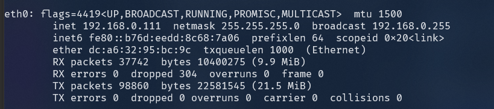

再参考的文章中作者使用的是自己的image但为了更新和安全，我更想使用官方的镜像。

官方的镜像的名字是 `openwrtorg/rootfs`，因为树莓派为 arm 架构所以 tag 应该是 armvirt-32，这里使用 armvirt-64 会有兼容性问题，可能是因为虽然 pi4b 用的是 64 位的处理器但官方的 Raspian 还是 32 位的系统。如果要使用 armvirt-64 的话可以使用 raspbian 自带的64位内核 kernel8.img，使用方法是修改 /boot/config.txt，在最后添加 `arm_64bit=1` 然后重启就可以了，使用 `cat /proc/version` 看到 `4.19.97-v8+` 这个 v8 就代表成功更换到 64 位的内核了 （但只有 64 位的内核又是还是不能运行一些 64 位的程序。。。）

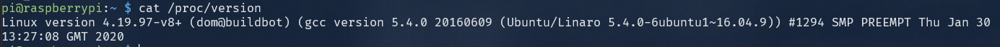

然后是在 docker 里创建一个 macvlan 的网络，这种网络可以在一个物理网卡上运行多个 ip 地址，网卡会使用不同的 mac 地址来区分

命令：

`docker network create -d macvlan --subnet=192.168.0.0/24 --gateway=192.168.0.1 -o parent=eth0 macnet`

subnet 和 gateway 要在同一网段，然后最后的 macnet 就是网络的名字

接下来就可以运行镜像啦

```bash
docker run --restart always --name openwrt -d --network macnet --privileged openwrtorg/rootfs:armvirt-32
```

注意这个 `--privileged` 参数是不可或缺的，不然没法用，原因不明

## 配置openwrt

进入容器首先要更改网络配置 /etc/config/network ，删除里面的wan的配置，添加如下

```bash
config interface 'lan'
        option type 'bridge'
        option ifname 'eth0'
        option proto 'static'
        option ipaddr '192.168.0.234'
        option netmask '255.255.255.0'
        option ip6assign '60'
        option gateway '192.168.0.1'
        option broadcast '192.168.0.255'
        option dns '192.168.0.1'
```

这里的 ipaddr，gateway，和 dns 都是根据实际情况来设置，因为这里我是用树莓派做**旁路由**所以gateway 和 dns 就是填的路由器的 ip 地址

然后重启网络 `/etc/init.d/network restart`

这个命令看起来和系统里面的 service 命令的格式差不多，我想是不是 service 命令就是调用的 init.d 里的东西呢？

## opkg换源

参考<https://pylist.com/t/1555924557>

源：http://mirrors.ustc.edu.cn/lede/releases/18.06.4/packages/

openwrt的版本可以使用 `cat /etc/banner` 来查看 linux 内核版本可以使用 `cat /proc/version` 或者 `uname -a` 查看

因为树莓派的 BCM2711 是 cortex-A72 架构，所以在这里里面选择 aarch64_cortex-a72 然后里面有base，luci 等的链接把这些链接替换到 /etc/opkg/distfeeds.conf 例如

然后执行 `opkg update` 就可以了

如果 wget 报错可以把 https 给成 http

发现在官方源里面有树莓派 bcm2711 的源，但其他源里没有，不知道为什么

`src/gz openwrt_core http://downloads.openwrt.org/snapshots/targets/brcm2708/bcm2711/packages/`

有用的源

```bash
src/gz openwrt_core http://openwrt.rinvay.cc/snapshots/targets/armvirt/64/packages/
src/gz openwrt_base http://openwrt.rinvay.cc/snapshots/packages/aarch64_generic/base
src/gz openwrt_luci http://openwrt.rinvay.cc/snapshots/packages/aarch64_generic/luci
src/gz openwrt_packages http://openwrt.rinvay.cc/snapshots/packages/aarch64_generic/packages
src/gz openwrt_routing http://openwrt.rinvay.cc/snapshots/packages/aarch64_generic/routing
src/gz openwrt_telephony http://openwrt.rinvay.cc/snapshots/packages/aarch64_generic/telephony
```

用了一段时间以后重装后发现luci安装后进入不了页面了会显示

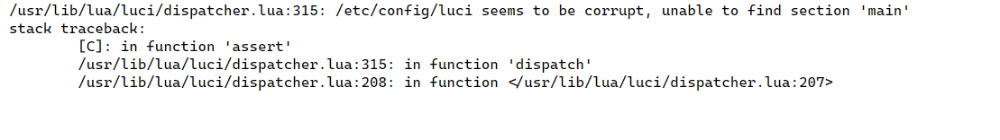

并且在安装luci时会报没有依赖 `libiwinfo20181126` 在 google 后看到这个包在

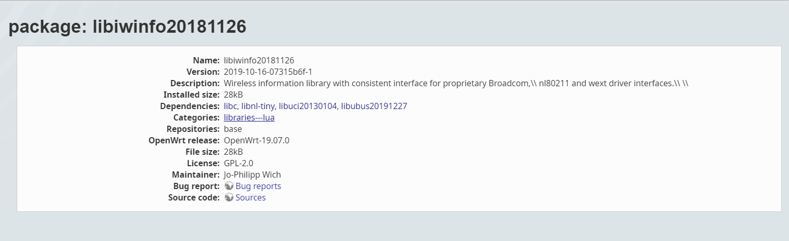

19.07.0的包里有，于是去openwrt网站上找到了这个 [http://archive.openwrt.org/releases/19.07.0/targets/armvirt/64/packages/](http://archive.openwrt.org/releases/19.07.0/targets/armvirt/64/packages/)

替换后安装成功了，但网页还是会报错，想了想这几天 openwrt/rootfs:armvirt-64 的镜像更新了，这应该就是唯一的变量了，于是到 docker hub 上找到老版本的 image

```bash
sudo docker pull openwrtorg/rootfs:armvirt-64-19.07.1
docker run --restart always --name openwrt -d --network macnet --privileged openwrtorg/rootfs:armvirt-64-19.07.1
```

顺便一不做二不休，直接所有都用19.07.1的软件源，如下

```bash
src/gz openwrt_core http://archive.openwrt.org/releases/19.07.0/targets/armvirt/64/packages/
src/gz openwrt_base http://openwrt.rinvay.cc/releases/19.07.0/packages/aarch64_generic/base
src/gz openwrt_luci http://openwrt.rinvay.cc/releases/19.07.0/packages/aarch64_generic/luci
src/gz openwrt_packages http://openwrt.rinvay.cc/releases/19.07.0/packages/aarch64_generic/packages
src/gz openwrt_routing http://openwrt.rinvay.cc/releases/19.07.0/packages/aarch64_generic/routing
src/gz openwrt_telephony http://openwrt.rinvay.cc/releases/19.07.0/packages/aarch64_generic/telephony
```

然后就行了。。。

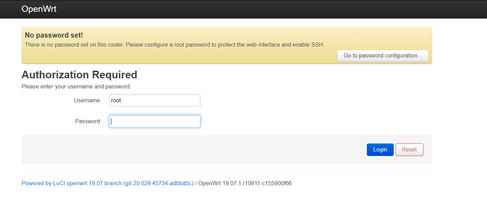

为了以后重装的时候方便，这次我想把使用的docker镜像保存下来，上传到docker hub上这样下次重装只要pull下来就可以了

# 上传到docker hub

保存镜像  docker commit [OPTIONS] CONTAINER [REPOSITORY[:TAG]]

docker commit openwrt lyine/openwrt_with_clash

首先登陆 docker

`docker login`

输入docker id和密码就可以登陆了

然后上传 `docker push [OPTIONS] NAME[:TAG]`

`docker push lyine/openwrt_with_clash`

commit 和 push 默认的 tag 均为 latest

## 安装luci

`opkg install luci --force-depends`

这里最后会报一个错原因不明，但带没有发现影响使用

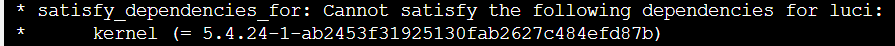

然后启动uhttp服务

`/etc/init.d/uhttpd enable`

查看 `/etc/init.d/uhttpd status` 服务为 running 后就可以通过设置的 ip 地址访问 luci 了

因为我是使用树莓派做旁路由，所以要停用openwrt的DHCP服务

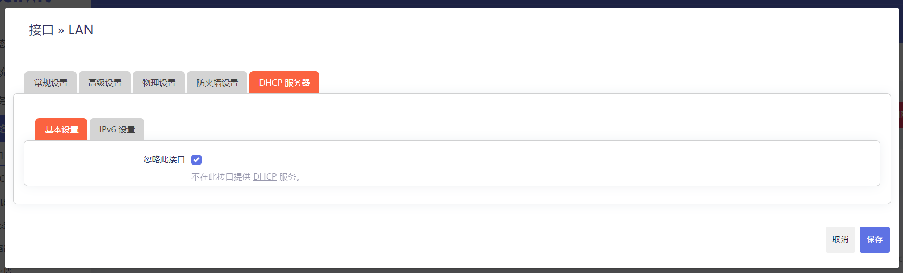

<aside>
💡 记得安装 `opkg install luci luci-base luci-compat` ，不然很多luciapp会打不开，好像主要是 luci-compat 的问题

</aside>

## luci本地化

主题：https://github.com/jerrykuku/luci-theme-argon/releases

注意区分主题的版本，snapshot 和 stable 使用的主题版本是不同的，如果使用了错误的版本会导致luci网页白屏，遇到这种情况可以修改 /etc/config/luci 文件中的 `option mediaurlbase '/luci-static/argon'` 为 `option mediaurlbase '/luci-static/bootstrap'`。然后刷新页面就可以了

中文：`opkg install luci-i18n-base-zh-cn`

如果想上传软件到openwrt上可以在luci->software里上传package当出现下面的提示时

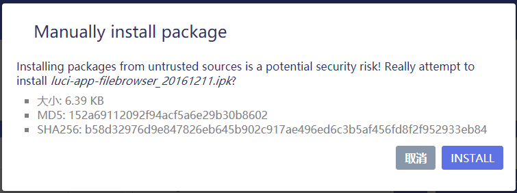

到 /tmp 中可以看到一个叫upload.ipk的文件

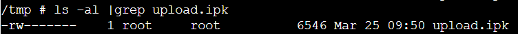

# 安装使用clashr

首先安装 luci-app-clash

再设置页面里面选择clashr，架构为linux-armv7（其实树莓派4是64位的cpu应该可以使用armv8的，但因为raspbian位32位的所以只能选32位的armv7

### 安装内核

<aside>
💡 按下面写的步骤就可以了，记得解压并重命名文件为clash就可以了！！不用去 `opkg install`

</aside>


发现有个 openclash 比这个好用多了，只要自己手动把 clashr 的内核重命名为 clash 再复制到 /etc/openclash 就可以使用了，配置选项也更全面了

github: [https://github.com/vernesong/OpenClash](https://github.com/vernesong/OpenClash)

内核：https://github.com/frainzy1477/clashrdev/releases

<aside>
💡 安装时可能出现因为包不兼容导致无法安装的情况。这时候在安装时加如参数 `--force-overwrite` 一般可以解决问题

</aside>

比如  `opkg install  /tmp/upload.ipk  --force-overwrite --force-depends`

下载内核后重命名为clash上传到 /etc/openclash/，更改权限为770 `chmod 770 clash`

订阅转换使用的 [https://api.nameless13.com/](https://api.nameless13.com/) 面板，后端可以很容易的用docker搭建，所以就搭在自己ECS上了


配置规则只用的是这个多策略默认白名单模式

### smartdns+clash

参考 https://github.com/vernesong/OpenClash/wiki/DNS%E8%AE%BE%E7%BD%AE

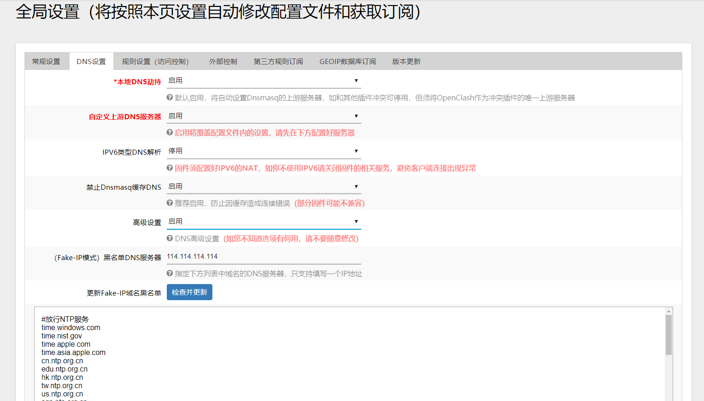

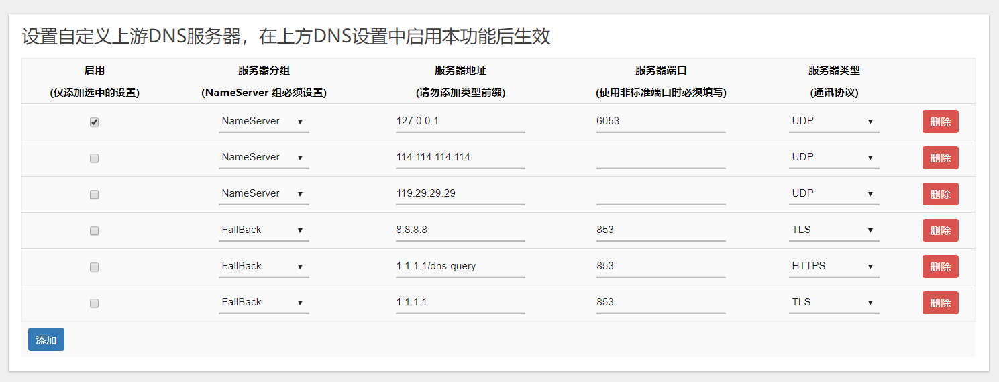

启用openclash自带的dns服务器，开启自定义上游服务器，在下方dns服务器设置中添加本地smartdns服务的端口并启用

记得在smartdns的设置里面关闭端口重定向

<aside>
💡 注意：openclash里面的配置文件不能重名，就算删除了以前的配置参数也不能。否则会让配置文件不改变。

</aside>

## 使用 airplay audio

```bash
#shairplay
opkg install shairplay --force-depends
opkg install luci-app-shairplay luci-i18n-shairplay-zh-cn
#shareport-sync
```

### docker访问mount的硬盘

要重启容器才能看到mount的硬盘。。

## 问题

经常luci网页会打开很慢，现在猜测可能是https的关系？好像http就没有问题。

没错，就是这个问题！！！！！！！！ 现在只要在
/etc/config/uhttpd 里把 `option redirect_https '1'` 改成 `option redirect_https '0'` 禁用https重定向就解决问题了！！！

## 其他

创建并进入容器 `sudo docker run --rm -it nginx bash`